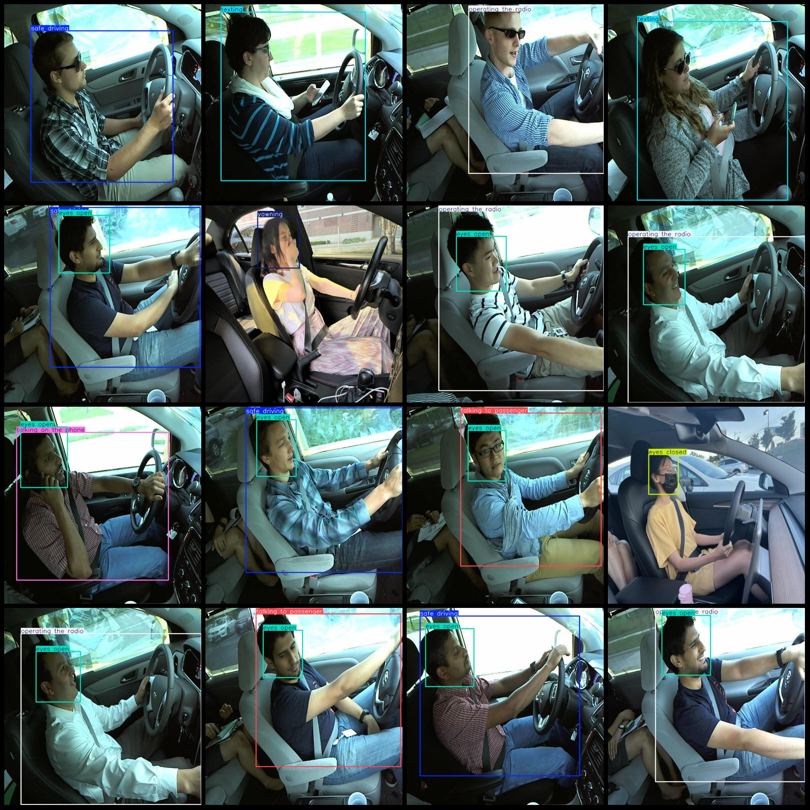
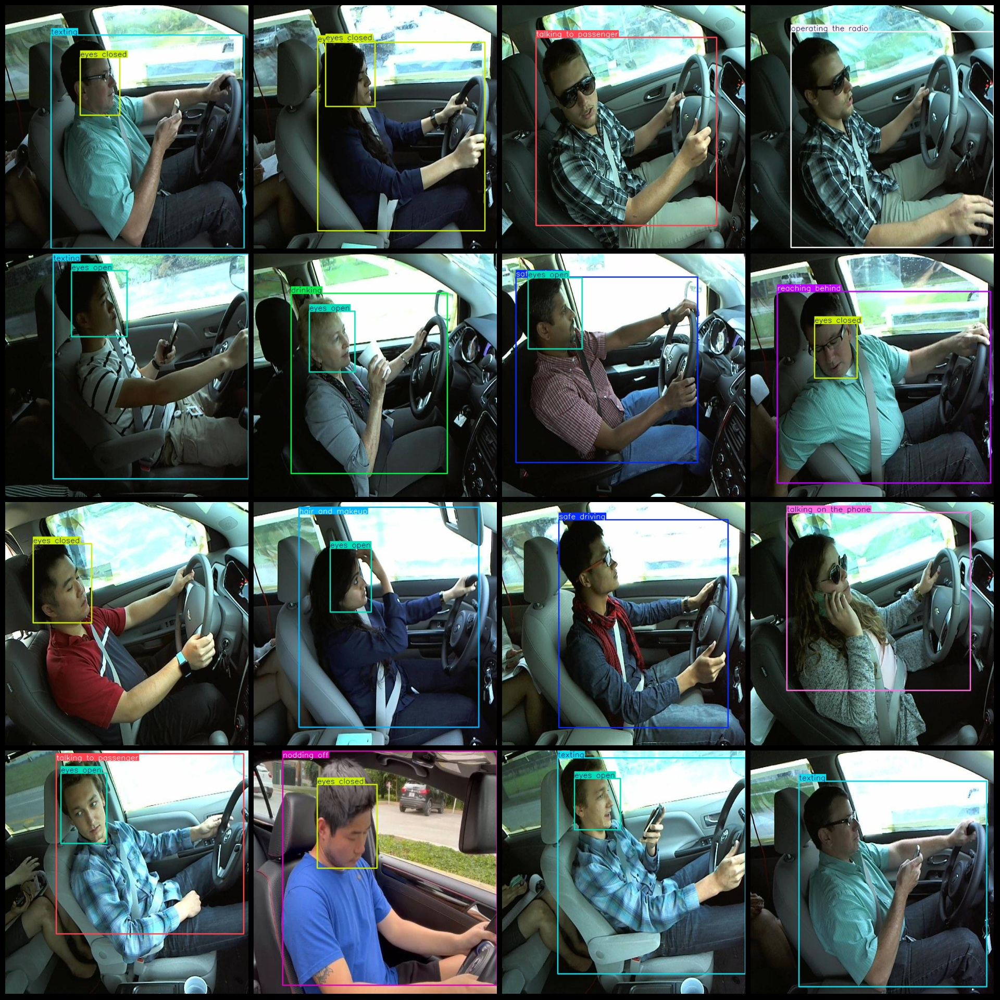

# Driver Fatigue and Distraction: Calls, Sleeping, Drinking Detection Dataset in VOC+YOLO Format with 8864 Images and 12 Categories

Pascal VOC format+YOLO format (without split path in txtfile, only containing jpg image and corresponding VOC format xmlfile and yolo format txtfile)
number of images: 8864  
annotation count: 8864  
annotation count: 8864  
annotationnumber of classes: 12  
annotation class names: ["drinking", "eyes closed", "eyes open", "hair and makeup", "nodding off", "operating the radio", "reaching behind", "safe driving", "talking on the phone"]
"talking to passenger","texting","yawning"]  
boxes per class:   
Drinking box count = 1003
Eyes closed box count = 1466
Eyes open box count = 4931
Hair and makeup box count = 997
Dozing off box count = 218
Operating the radio box count = 988
Reaching behind box count = 1012
Safe driving box count = 1181
Talking on the phone box count = 997
Talking to passenger box count = 927
Texting box count = 1001
Yawning box count = 336
total boxes: 15057  
image resolution: 640x640  
Using the annotation tool: labelImg
Annotation rules: draw a rectangle around the class.
Important notes: None
Special statement: This dataset does not guarantee the accuracy of the trained model or weight file.
Image preview:
## Images

Here is a pay link on Stripe ( https://buy.stripe.com/3cs8yP7sY87d0vu9AB ). Please contact me lonlonago@foxmail.com after funding $89, and I will send you a complete data files , thank you!

